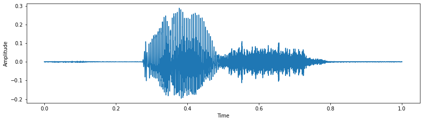
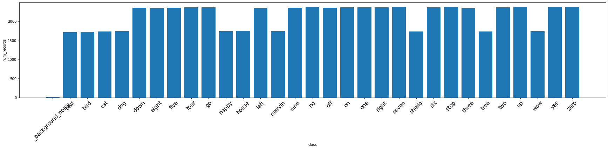
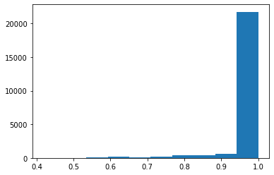
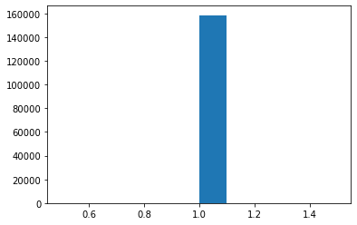
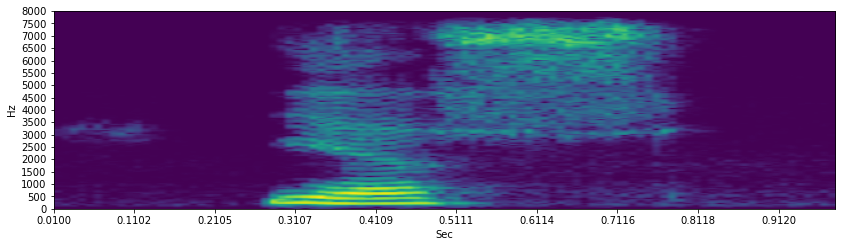
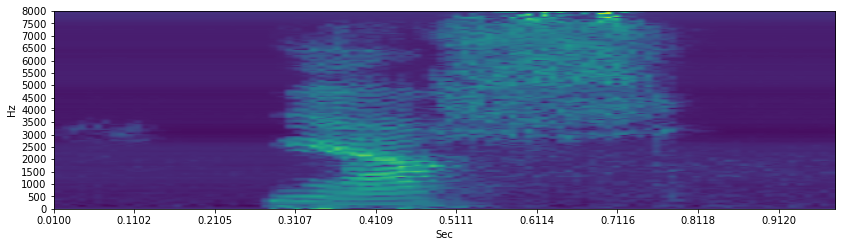
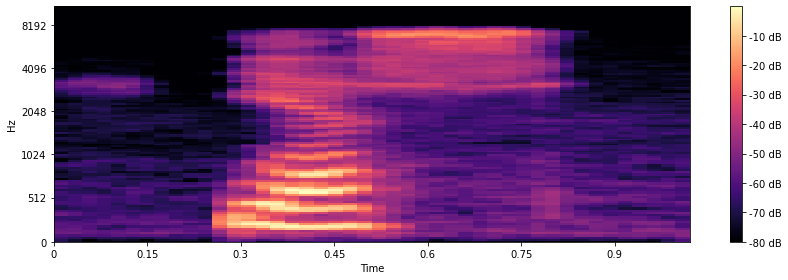
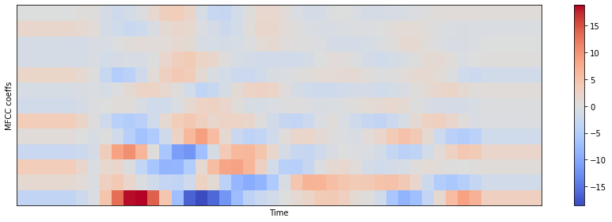

```python
import os
import glob
import numpy as np
import matplotlib.pyplot as plt
from tqdm import tqdm

import IPython.display as ipd
import librosa
import scipy
from scipy.io import wavfile
from scipy import signal
```

데이터 불러오기


```python
dataset = []
for filepath in glob.iglob('train\\audio/**/*.wav', recursive=True):
    label = filepath.split("\\")[2]
    dataset.append([filepath,label])
dataset = np.array(dataset)
classes = np.unique(dataset[:,1])
```

데이터 시각화해보기


```python
y, sr = librosa.load("train/audio/yes/0a7c2a8d_nohash_0.wav")
fig = plt.figure(figsize=(14,8))
ax1 = fig.add_subplot(211)
ax1.set_xlabel('Time')
ax1.set_ylabel('Amplitude')
ax1.plot(np.linspace(0,sr/len(y),sr), y) #x축을 샘플->시간으로 나타내기
sr, len(y)
```


    (22050, 22050)


    

    


```python
y
```


    array([ 4.0688968e-04,  3.1694559e-05, -4.5456085e-04, ...,
            5.9469097e-04,  8.1928732e-04,  6.3908176e-04], dtype=float32)


라벨 별 비율 알아보기


```python
num_records=[]
for label in classes:
    num_records.append(len([f for f in os.listdir('train\\audio\\' + label) if f.endswith('.wav')]))
    
plt.figure(figsize=(30,5))
index = np.arange(len(classes))
plt.bar(index, num_records)
plt.xlabel('class')
plt.ylabel('num_records')
plt.xticks(index, classes,fontsize=15, rotation=45)
plt.show()
```


    

    


10개 라벨 : unknown 비율 알아보기


```python
num_records = dict()
for label in classes:
    num_records.update({label:len([f for f in os.listdir('train\\audio\\' + label) if f.endswith('.wav')])})

label_10 = ["yes", "no", "up", "down", "left", "right", "on", "off", "stop", "go"]
n_label_10 = 0
n_unknown = 0
for k,v in num_records.items():
    if k in label_10:
        n_label_10+=v
    else:
        n_unknown+=v

n_label_10, n_unknown
```


    (23682, 41045)


duration 알아보기


```python
classes = ["yes", "no", "up", "down", "left", "right", "on", "off", "stop", "go"]
duration_records = []
for label in tqdm(classes):
    waves = [f for f in os.listdir('train\\audio\\' + label) if f.endswith('.wav')]
    for wav in waves:
        #y, sr = librosa.load('train\\audio\\' + label + '\\' + wav)
        sr, y = wavfile.read('train\\audio\\' + label + '\\' + wav)
        duration_records.append(len(y)/sr)
```

    100%|██████████████████████████████████████████████████████████████████████████████████| 10/10 [00:04<00:00,  2.24it/s]
    


```python
plt.hist(duration_records)
```


    (array([1.5000e+01, 3.0000e+01, 4.4000e+01, 1.3800e+02, 1.3600e+02,
            1.7900e+02, 3.6600e+02, 4.3400e+02, 5.9300e+02, 2.1747e+04]),
     array([0.418 , 0.4762, 0.5344, 0.5926, 0.6508, 0.709 , 0.7672, 0.8254,
            0.8836, 0.9418, 1.    ]),
     <BarContainer object of 10 artists>)


    

    


test데이터 duration 알아보기


```python
duration_records = []
for wav in glob.iglob('test\\audio\\*.wav'):
    sr, y = wavfile.read(wav)
    duration_records.append(len(y)/sr)
```


```python
plt.hist(duration_records)
```


    (array([     0.,      0.,      0.,      0.,      0., 158538.,      0.,
                 0.,      0.,      0.]),
     array([0.5, 0.6, 0.7, 0.8, 0.9, 1. , 1.1, 1.2, 1.3, 1.4, 1.5]),
     <BarContainer object of 10 artists>)


    

    


### 로그 스펙트로그램을 계산하는 함수
로그에 대한 입력으로 0값이 없음이 보장되어야 하므로, eps을 정의한다. <br><br>
win_size, step_size : time기준<br>
nperseg, noverlap : 샘플기준<br>
window : 윈도우함수<br>
scaling : {'density','spectrum'}<br>
detrend : {'linear','constant',False}


```python
def log_specgram(audio, sr, win_size=20, step_size=10, eps=1e-10):
    nperseg = int(round(win_size*sr/1e3))     # 윈도우당 샘플수
    noverlap = int(round(step_size*sr/1e3))   # 스텝당 샘플수
    freqs, times, spec = signal.spectrogram(audio,
                                           fs=sr,
                                           window='hann',
                                           nperseg=nperseg,
                                           noverlap=noverlap,
                                           detrend=False)
    return freqs, times, np.log(spec.T.astype(np.float32)+eps)
```

log_spectrogram 시각화


```python
freqs, times, log_spec = log_specgram(y, sr)
fig = plt.figure(figsize=(14,8))
ax1 = fig.add_subplot(211)
ax1.imshow(log_spec.T, aspect='auto', origin='lower',
          extent=[times.min(),times.max(),freqs.min(),freqs.max()])
ax1.set_yticks(freqs[::10])
ax1.set_xticks(times[::10])
ax1.set_ylabel('Hz')
ax1.set_xlabel('Sec')
plt.ylim([0,8000])
```


    (0.0, 8000.0)


    

    


스펙트로그램 정규화


```python
mean = np.mean(log_spec, axis=0)
std = np.std(log_spec, axis=0)
log_spec = (log_spec - mean) / std
```


```python
fig = plt.figure(figsize=(14,8))
ax1 = fig.add_subplot(211)
ax1.imshow(log_spec.T, aspect='auto', origin='lower',
          extent=[times.min(),times.max(),freqs.min(),freqs.max()])
ax1.set_yticks(freqs[::10])
ax1.set_xticks(times[::10])
ax1.set_ylabel('Hz')
ax1.set_xlabel('Sec')
plt.ylim([0,8000])
```


    (0.0, 8000.0)


    

    


### mel 스펙트로그램


```python
from librosa import display
S = librosa.feature.melspectrogram(y=y.astype(np.float16), sr=sr, n_mels=128)
log_S = librosa.power_to_db(S, ref=np.max)

plt.figure(figsize=(12,4))
display.specshow(log_S, sr=sr, x_axis='time', y_axis='mel')
plt.colorbar(format='%+02.0f dB')
plt.tight_layout()
```

    C:\Users\dkdle\anaconda3\lib\site-packages\librosa\display.py:974: MatplotlibDeprecationWarning: The 'basey' parameter of __init__() has been renamed 'base' since Matplotlib 3.3; support for the old name will be dropped two minor releases later.
      scaler(mode, **kwargs)
    C:\Users\dkdle\anaconda3\lib\site-packages\librosa\display.py:974: MatplotlibDeprecationWarning: The 'linthreshy' parameter of __init__() has been renamed 'linthresh' since Matplotlib 3.3; support for the old name will be dropped two minor releases later.
      scaler(mode, **kwargs)
    


    

    


### MFCC


```python
mfcc =librosa.feature.mfcc(S=log_S, n_mfcc=13)
delta2_mfcc = librosa.feature.delta(mfcc, order=2)

plt.figure(figsize=(12,4))
librosa.display.specshow(delta2_mfcc)
plt.ylabel('MFCC coeffs')
plt.xlabel('Time')
plt.colorbar()
plt.tight_layout()
```


    

    


```python

```


```python

```


```python

```
